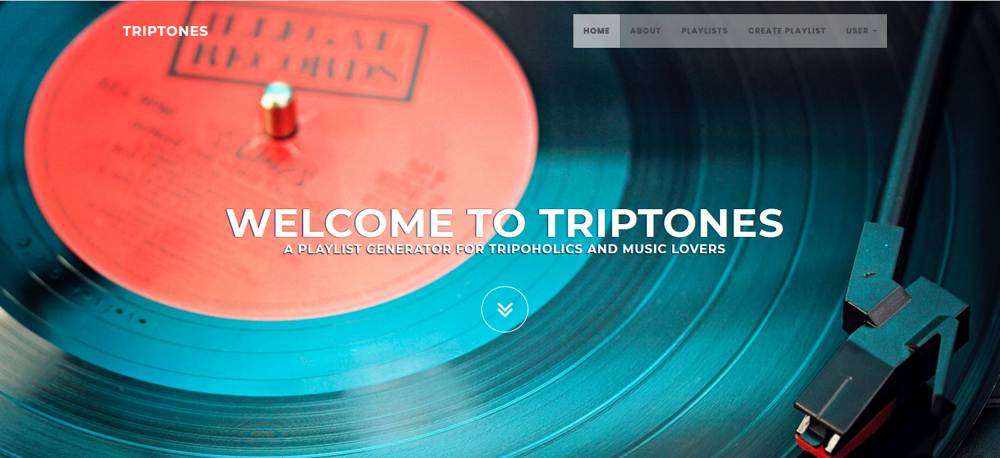
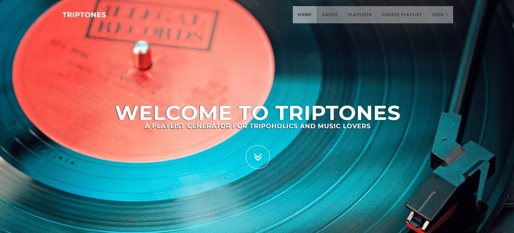

# Playlist Generator

A playlist generator for tripoholics and music lovers

## Table of contents
* [General info](#general-info)
* [Home Page](#screenshots)
* [Setup](#setup)
* [Features](#features)
* [Contact](#contact)

## General info

Playlist Generator calculates the travel duration time between the starting and destination locations and combines tracks chosen randomly in the specified genres, until the playing time roughly matches the travel time duration.

### Public Part
The public part is visible without authentication. This includes the application start page, the user login and user registration forms, as well as the list of all user generated playlists. People that are not authenticated cannot see any user specific details, neither they can interact with the website. They can only browse the playlists and see the tracks list and details of them.

### Private Part (Users Only)
The private part is accessible only to users who have successfully authenticated (registered users).
The private part of the web application provides the users the ability to generate new playlists, control the generation algorithm, edit or delete their own existing playlists.
Editing existing playlists is limited to changing the title or associated genre tags, but does not include editing of the tracklist (e.g. removing or adding individual songs).

### Administration Part
Users with the system administrator role can administer all major information objects. The administrators have the following functionality

* CRUD over users and other administrators
* CRUD over the playlists

External Services
The Playlist Generator web application consume two public REST services in order to achieve the main functionality.

Microsoft Bing Maps External Service
We will use this external service to help us calculate the travel duration between two addresses.
Official doc: https://docs.microsoft.com/en-us/bingmaps/rest-services/routes/calculate-a-distance-matrix

Deezer External Service
Deezer is an audio streaming service, which will help us search and gather the tracks needed for the playlist generation.
Official doc: https://developers.deezer.com/login?redirect=/api

## Home Page

## Features
* Create Playlist

* Admin Panel and Delete Playlist

## Contact
Created by Hrista Raleva and Georgi Dekov.

https://www.telerikacademy.com/alpha/java

Trello board: https://trello.com/b/2GUrfCVI/playlist-generatorrr

